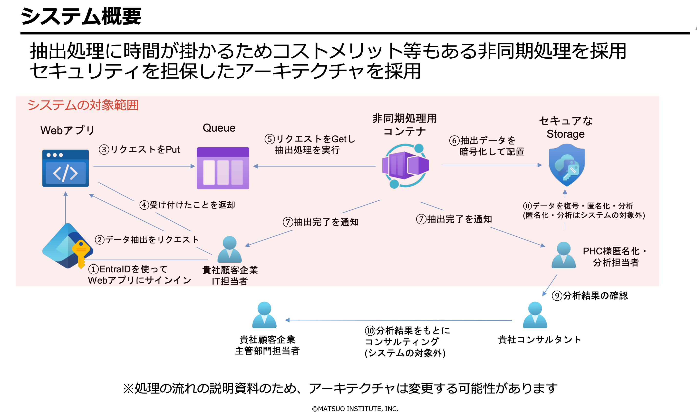
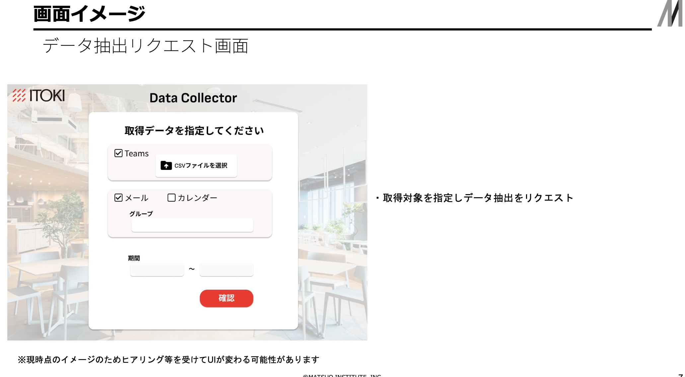

- 開発フェーズ
  - 下記を CI/CD パイプライン等で自動で実施する仕組み作りの構築
  - Dependabot/Renovate 等によるライブラリの脆弱性検知
  - Trivy 等を用いたコンテナの脆弱性検知
  - 静的コード解析（SAST）の実行
  - OWASP ZAP 等を用いた脆弱性診断（リリース前に手動実行の想定）
- 運用フェーズ
  - EntraID での SSO による認証認可
  - ホワイトリスト式の IP 制限により特定顧客企業のみアクセス許可
  - Microsoft Defender シリーズを利用したランタイムの異常検知
  - 抽出データは暗号化により保護
  - 監査ログとアクセスログの取得により誰がアクセスしたかを追跡可能

### アーキ図以外でやること

- Terraform を用いたインフラのコード化はやったほうが良いんだろうな
- CICD パイプラインの構築
- 脆弱性診断、静的解析
- SSO
- 監査ログ、アクセスログの取得

### やらないこと（スコープ外と明記）

- 監査ログ、アクセスログのダッシュボード、設定画面の実装
- データキャッシュ

- 開発環境をこっちのAzureにもつか、イトーキにもつか、は要相談
  - 開発環境がイトーキなら、うちサンドボックスを仮想顧客にしてもいいね
- SSOしたいIDはイトーキのさらに先になる
  - MSのテナントはイトーキのAzureのEntra IDと紐づければいけそう
  - ただしプロファイルをどのくらい持ってこれるかが不明
- マルチテナントになる

以下のアーキテクチャを考えましたが、破綻はないでしょうか？

顧客 -> Microsoft Entra ID 認証 -> Front Doors IP制限 -> Static Web Appフロントエンド
顧客 -> Microsoft Entra ID 認証 -> API Management -> Functions -> Cosmos DBテナント解決 -> Queue Storage -> Container App非同期処理 -> Key Vault APIキー取得 -> APIでデータ取得 -> Blob Storageデータ保存 -> Communication Service完了メール通知
Github -> GitHub Actions ビルド・プッシュ -> Container Registry -> Functions/Container Appアップデート
Github -> Terraform -> Resource Manager
（Static Web AppsはGithub自動監視デプロイ）